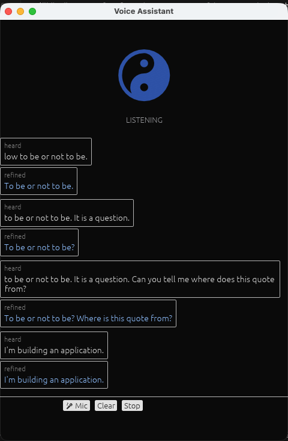

# azVoiceAssist

> A local, always-listening AI voice assistant — speak naturally, hear yourself back refined.



azVoiceAssist runs **entirely on your Mac**. No cloud, no subscriptions, no data leaving your machine. Speak a sentence, pause — the app transcribes what you said, cleans up filler words and grammar with a local language model, and speaks the refined version back in a natural voice.

---

## What it does

- 🎙️ **Always listening** — VAD (voice activity detection) wakes the pipeline the moment you speak
- ✏️ **Refines your speech** — a local LLM removes filler words, fixes grammar, keeps your meaning
- 🔊 **Speaks it back** — Qwen3-TTS generates natural-sounding speech on Apple Silicon
- 🪟 **Floats on your desktop** — transparent frosted-glass window, always on top, drag anywhere
- 🔇 **Barge-in** — speak while the app is talking and it stops immediately
- ⚙️ **Configurable** — silence timeout, speech threshold, blur/opacity all adjustable in the UI
- 🔒 **100% local** — every model runs on your machine

---

## Requirements

- **macOS** with Apple Silicon (M1/M2/M3/M4)
- **Rust** toolchain (`curl --proto '=https' --tlsv1.2 -sSf https://sh.rustup.rs | sh`)
- **Homebrew** (`brew install cmake pkg-config speexdsp`)
- **Python 3.11+** for the TTS service
- **oMLX** — a local OpenAI-compatible LLM server (e.g. [oMLX](https://github.com/jundot/omlx), LM Studio, or any server that exposes `/v1/chat/completions`). This is what refines your speech.
- **Qwen3-TTS** model weights — downloaded automatically on first run (~1.8 GB)

---

## Quick start

### 1. Start your local LLM server

Any OpenAI-compatible server on port 8002 works. Example with oMLX:

```bash
# oMLX: https://github.com/jundot/omlx
# Start it with a model of your choice, note your API key
```

### 2. Start the TTS service

```bash
cd tts_service
python3 -m venv .venv
.venv/bin/pip install -r requirements.txt
.venv/bin/uvicorn server:app --port 8123
# First run downloads the Qwen3-TTS model (~1.8 GB)
```

### 3. Download Whisper and VAD models

```bash
cd rust
mkdir -p models
# Whisper base (English) — ~141 MB
curl -L -o models/ggml-base.en.bin \
  https://huggingface.co/ggerganov/whisper.cpp/resolve/main/ggml-base.en.bin

# Silero VAD — ~2 MB
curl -L -o models/silero_vad.onnx \
  https://github.com/snakers4/silero-vad/raw/master/src/silero_vad/data/silero_vad.onnx
```

### 4. Configure and run

```bash
cd rust
export OMLX_BASE_URL="http://127.0.0.1:8002/v1"   # your LLM server URL
export OMLX_API_KEY="YOUR_API_KEY"                  # your LLM server API key
export OMLX_MODEL="your-model-name"                 # model to use for refinement

cargo run
```

The floating window opens. Speak — the app listens, refines, and speaks back.

> **Note:** On first launch, macOS will prompt for microphone permission. Grant it to the terminal or app you used to run the command.

---

## Configuration

Click the **⚙** button in the bottom-right to open the settings panel:

| Setting | What it does |
|---------|-------------|
| **System Prompt** | The instruction that tells the LLM how to refine your speech. Change this to make the assistant coach, summarize, translate, etc. |
| **Silence timeout** | How long a pause (ms) ends a turn. Lower = snappier; higher = tolerates mid-sentence pauses. |
| **Speech threshold** | How confident the VAD must be before starting a turn. Lower = more sensitive; higher = ignores background noise. |
| **Context turns** | How many past turns are included in each refinement call. `0` = stateless (fastest). |
| **Background blur** | Frosted-glass blur amount (0–40 px). Adjust to your taste. |
| **Background opacity** | Window darkness (5–70%). Lower = more see-through. |

Audio settings require **Apply** to take effect. Blur/opacity update live as you drag.

---

## How it works

```
Microphone
    ↓  cpal (48 kHz → 16 kHz)
Silero VAD  ←── Speex AEC (removes TTS echo)
    ↓  speech detected
Whisper (whisper.cpp, Apple Silicon)
    ↓  transcribed text
Local LLM via HTTP  ──►  /v1/chat/completions  (your oMLX / LM Studio / etc.)
    ↓  refined text
Qwen3-TTS service  ──►  :8123  (MLX-Audio, local)
    ↓  audio
Speaker  +  Tauri window (heard / refined transcript)
```

The Rust binary owns the entire audio pipeline. The two Python services (LLM and TTS) are local HTTP servers the binary calls — no data leaves your machine.

---

## Project structure

```
rust/            Rust desktop app (cpal, whisper-rs, Tauri)
static/          Web frontend (HTML/CSS/JS loaded by Tauri WebView)
tts_service/     Qwen3-TTS sidecar (Python, MLX-Audio)
assistant.py     Python voice assistant (alternative CLI/browser UI)
docs/archi/      Architecture diagrams
docs/bugfix/     Post-mortems from key debugging sessions
```

For architecture details see [`docs/archi/`](docs/archi/).

---

## Python app (alternative)

A Python-only version (`assistant.py`) is also included. It's simpler to set up but uses macOS `say` for TTS (robotic) and runs in a browser tab instead of a native window.

```bash
brew install portaudio
python3.12 -m venv .venv && source .venv/bin/activate
pip install -r requirements.txt
export OMLX_API_KEY="YOUR_API_KEY"
python assistant.py --ui   # opens browser UI at http://localhost:8765
```

---

## Troubleshooting

**"oMLX not reachable"** — Make sure your LLM server is running and `OMLX_BASE_URL` points to it.

**"Failed to start audio capture"** — macOS may have denied mic permission. Check System Settings → Privacy & Security → Microphone.

**Transcript doesn't appear / buttons don't work** — The app uses Tauri v2's WebView. Try restarting; the first launch occasionally needs a moment for the WebView to initialize.

**Transcript is blank even when you speak** — Check that your microphone is selected in System Settings → Sound → Input and the level meter moves when you speak.

---

## Contributing

Contributions are welcome. The codebase is documented with architecture diagrams (`docs/archi/`) and post-mortems (`docs/bugfix/`) that explain non-obvious decisions.

If you're adding a feature, please open an issue first to discuss the approach.

---

## License

MIT — see [LICENSE](LICENSE) (to be added).
