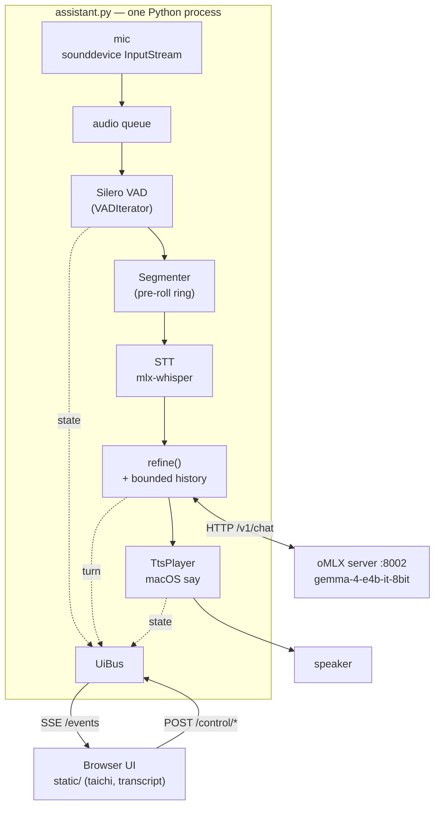
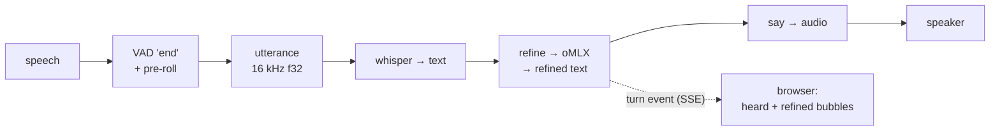

# Historical: Python loop + browser UI (P0 baseline)

> **Status:** Superseded. The Rust desktop app (see `02-shipped-rust-desktop.md`) is now
> the primary implementation. This doc is preserved as the P0 baseline reference.

The as-built system: one Python process (`assistant.py`) running the
`listen → transcribe → refine → speak` loop, with an optional in-process web UI
(`--ui`) served over SSE. TTS today is the macOS **`say`** command (system voices —
the part slated for upleveling).

## Architecture / components

## Dataflow — one turn

## Notes
- **TTS = macOS `say`** (system voices). Not neural; the uplevel target.
- oMLX is a separate long-lived HTTP service (the warm LLM).
- The browser UI is optional; without `--ui` the loop is pure CLI.
