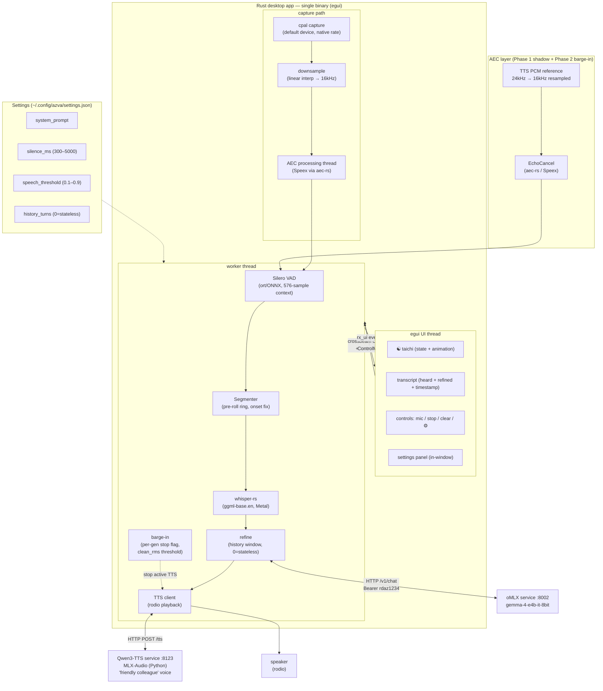
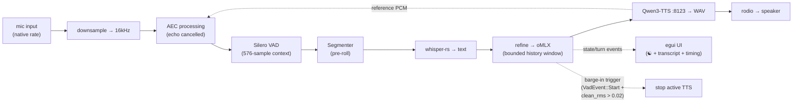

# Shipped Architecture — Rust Desktop App (main branch, as of 2026-06-02)

**Status:** Shipped and verified. PRs #1 (browser UI), #2 (AEC Phase 1), #3 (AEC Phase 2
/ barge-in) all merged to main. 41 tests pass. The egui UI is functional but visually
tool-like; the Tauri GUI upgrade is in progress on `feat/gui-enhancement`.

## Architecture / components

## Dataflow — one turn (with AEC)

## Key design decisions (shipped)

| Component | Decision | Rationale |
|-----------|----------|-----------|
| VAD | Silero ONNX with **64-sample context** prepended per frame | Without it, prob ≈ 0.001 on real speech (discovered in testing) |
| Capture rate | Device native → resample (linear interp) to 16kHz | `BufferSize::Fixed(512)` rejected by macOS CoreAudio |
| AEC | Phase 1 shadow mode (logs only) + Phase 2 barge-in | Speex AEC; `speaking` gate removed; per-gen stop flags |
| Barge-in | `VadEvent::Start` + `clean_rms > 0.02` → stop active TTS | Threshold prevents false triggers from AEC echo leakage |
| History | `deque(maxlen=40)`, **0 = stateless by default** | Stateless avoids refine slowdown after many turns |
| TTS voice | `"a clear natural male voice, calm, mid-range pitch"` | Spike-validated; Qwen3-TTS MLX-Audio service |
| Settings | `~/.config/azva/settings.json`, runtime-applied via `ControlMsg::SettingsChanged` | No restart required |

## What is NOT yet shipped (in progress)

- **Tauri GUI** (`feat/gui-enhancement`) — Deep Blue Frost transparent floating window replacing egui
- **RAG knowledge grounding** — deferred, separate spec
