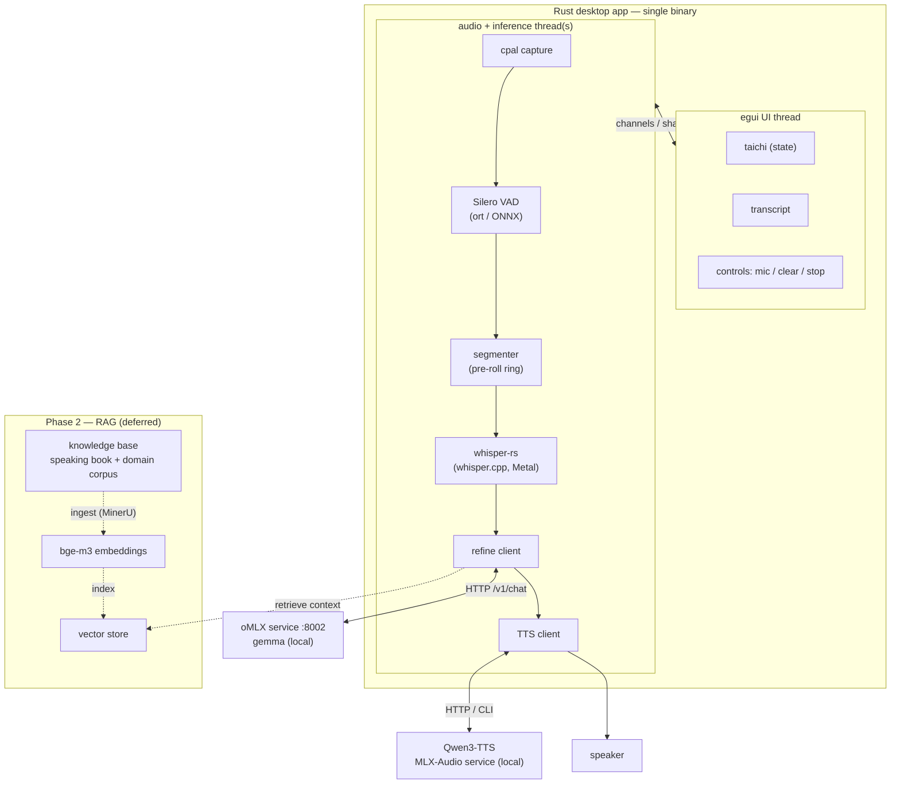
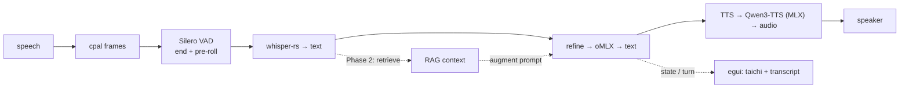

# Target Architecture — Native Rust desktop app (next phase)

**Decisions so far (brainstorm in progress):** full Rust rewrite of the pipeline;
**egui** native UI; **oMLX reused over HTTP** (the LLM is NOT reimplemented);
**whisper-rs** (whisper.cpp, Metal) for STT; **cpal** for capture; **Silero VAD via
ONNX (`ort`)**; **TTS pluggable** — the uplevel point (candidates below). **RAG is a
later phase** (shown dotted).

## Architecture / components

## Dataflow — one turn

## Component reuse vs rewrite

| Stage | Current (Python) | Target (Rust) | Status |
|-------|------------------|---------------|--------|
| Audio capture | sounddevice | **cpal** | rewrite |
| VAD | Silero (torch) | **Silero via `ort`/ONNX** | rewrite |
| Segmenter/pre-roll | pure Python | pure Rust | rewrite (port logic) |
| STT | mlx-whisper | **whisper-rs (whisper.cpp)** | rewrite |
| LLM / refine | oMLX HTTP client | **reqwest → oMLX** | **reuse service** |
| TTS | macOS `say` | **Qwen3-TTS via MLX-Audio** (local service, like oMLX) | **uplevel (new service)** |
| UI | web + SSE | **egui (in-process)** | rewrite (no SSE needed) |
| RAG | — | bge-m3 + vector store | **Phase 2** |

## TTS — decision: Qwen3-TTS via MLX-Audio

Chosen for best quality + voice cloning, fully local on Apple Silicon. Runs as a
**local model service** (Python/MLX-Audio) the Rust app calls over HTTP/CLI —
**architecturally a twin of oMLX**. So the runtime is: Rust app + oMLX (LLM) +
MLX-Audio (TTS), all local. (Rejected: Piper/Kokoro in-process ONNX — simpler/single-
binary but lower quality, no cloning; macOS `say` — robotic, current baseline.)
