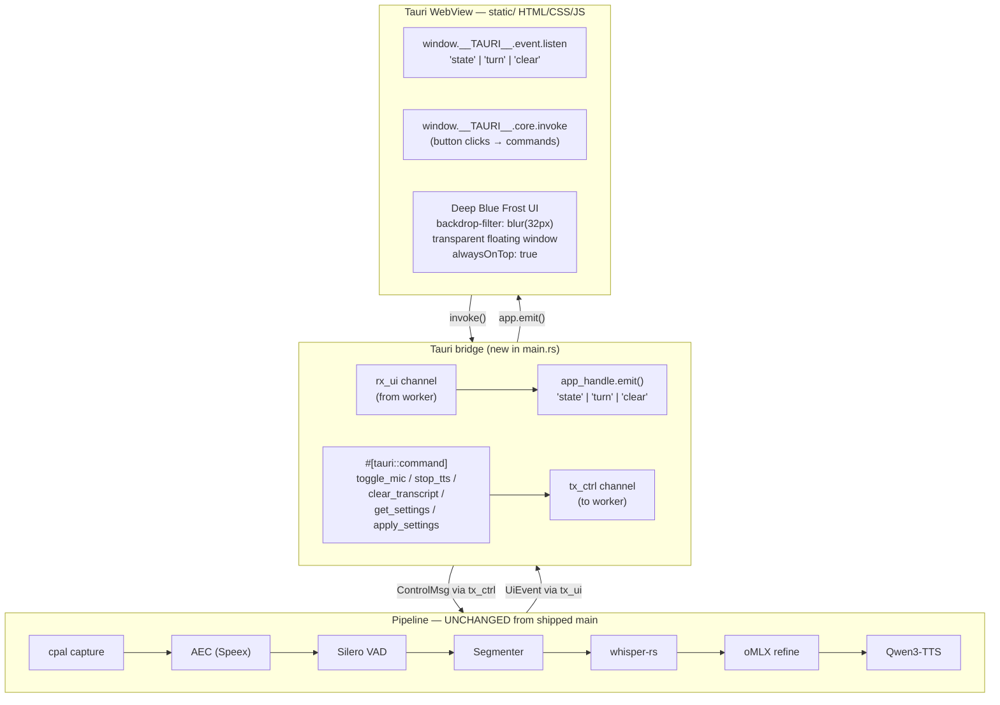
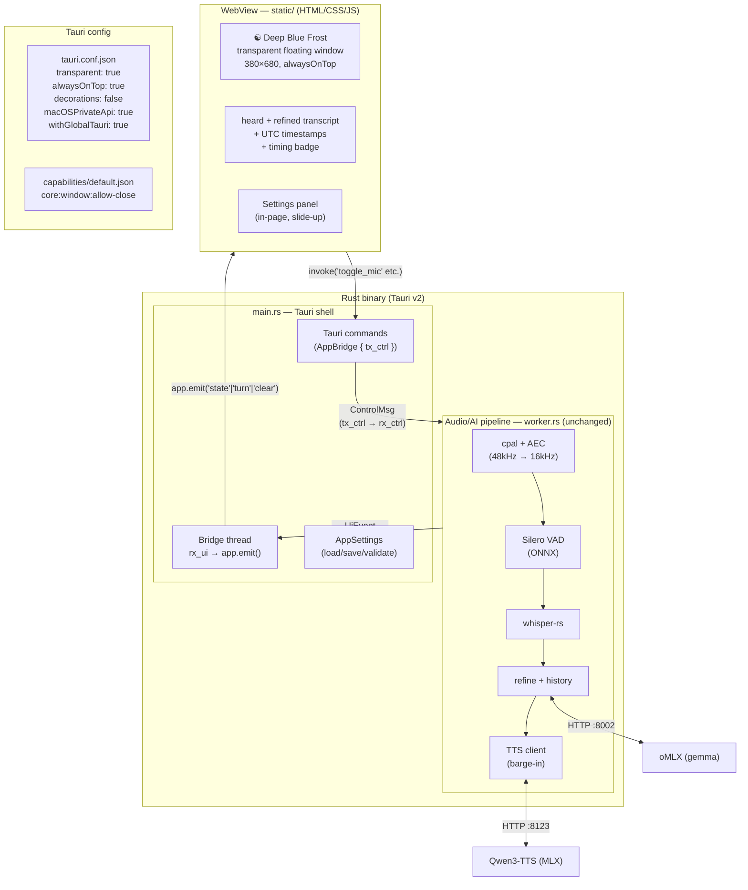

# Target Architecture — Tauri GUI (feat/gui-enhancement, in progress 2026-06-02)

**Status:** In progress. The Rust audio/AEC/barge-in pipeline is **unchanged**. Only the
UI shell changes — egui is replaced by a Tauri v2 WebView running the "Deep Blue Frost"
frontend (transparent floating window, `backdrop-filter: blur(32px)`).

## What changes vs what stays



## Architecture — Tauri app full picture



## UI design — Deep Blue Frost

```
┌─ drag region ──────────────────────────────────┐
│ ● [×]              Voice Assistant              │
│  ╔════════════════════════════════════════════╗ │
│  ║  background: rgba(10,12,28, 0.62)          ║ │
│  ║  backdrop-filter: blur(32px)               ║ │
│  ║  ← desktop wallpaper visible through ←    ║ │
│  ║                                            ║ │
│  ║           ☯  (blue glow/pulse)             ║ │
│  ║           LISTENING                        ║ │
│  ║   endpoint ~700ms · stt 88ms · ...         ║ │
│  ║                                            ║ │
│  ║  ┌──────────────────────────────────────┐  ║ │
│  ║  │ heard  18:14:22                      │  ║ │
│  ║  │ to be or not to be                   │  ║ │
│  ║  └──────────────────────────────────────┘  ║ │
│  ║  ┌──────────────────────────────────────┐  ║ │
│  ║  │ refined                              │  ║ │
│  ║  │ To be or not to be.          (blue)  │  ║ │
│  ║  └──────────────────────────────────────┘  ║ │
│  ║                                            ║ │
│  ║  [🎙 Mic] [⏹ Stop] [🗑 Clear]          [⚙] ║ │
│  ╚════════════════════════════════════════════╝ │
└─────────────────────────────────────────────────┘
```

## Key differences from egui version

| Aspect | egui (shipped) | Tauri (target) |
|--------|---------------|----------------|
| UI framework | egui (immediate mode, tool-like) | WebView (full CSS) |
| Transparency | Limited, no `backdrop-filter` | Native macOS blur, frosted glass |
| Animations | Manual painter code | CSS `@keyframes` |
| Settings | In-window egui panel | In-page HTML overlay |
| Window chrome | macOS title bar | Borderless, custom drag region |
| Frontend language | Rust (ui.rs) | HTML/CSS/JS (static/) |
| Pipeline | Unchanged | **Unchanged** |

## Files changed (Tauri migration)

```
rust/
  Cargo.toml          ← remove eframe/egui, add tauri="2"
  build.rs            ← tauri_build::build()
  src/main.rs         ← replace eframe::run_native with Tauri builder + bridge thread
  src/ui.rs           ← DELETED
  src/lib.rs          ← remove pub mod ui
  src/events.rs       ← add Serialize to payload structs
  src/timing.rs       ← add Serialize to TurnTiming
  tauri.conf.json     ← window config (transparent, alwaysOnTop, etc.)
  icons/icon.png      ← required by Tauri build
capabilities/
  default.json        ← Tauri v2 permission model
static/
  index.html          ← Deep Blue Frost layout, drag region, settings panel
  style.css           ← frosted glass, animations, transcript cards
  app.js              ← window.__TAURI__ listen/invoke (all inside DOMContentLoaded)
```
